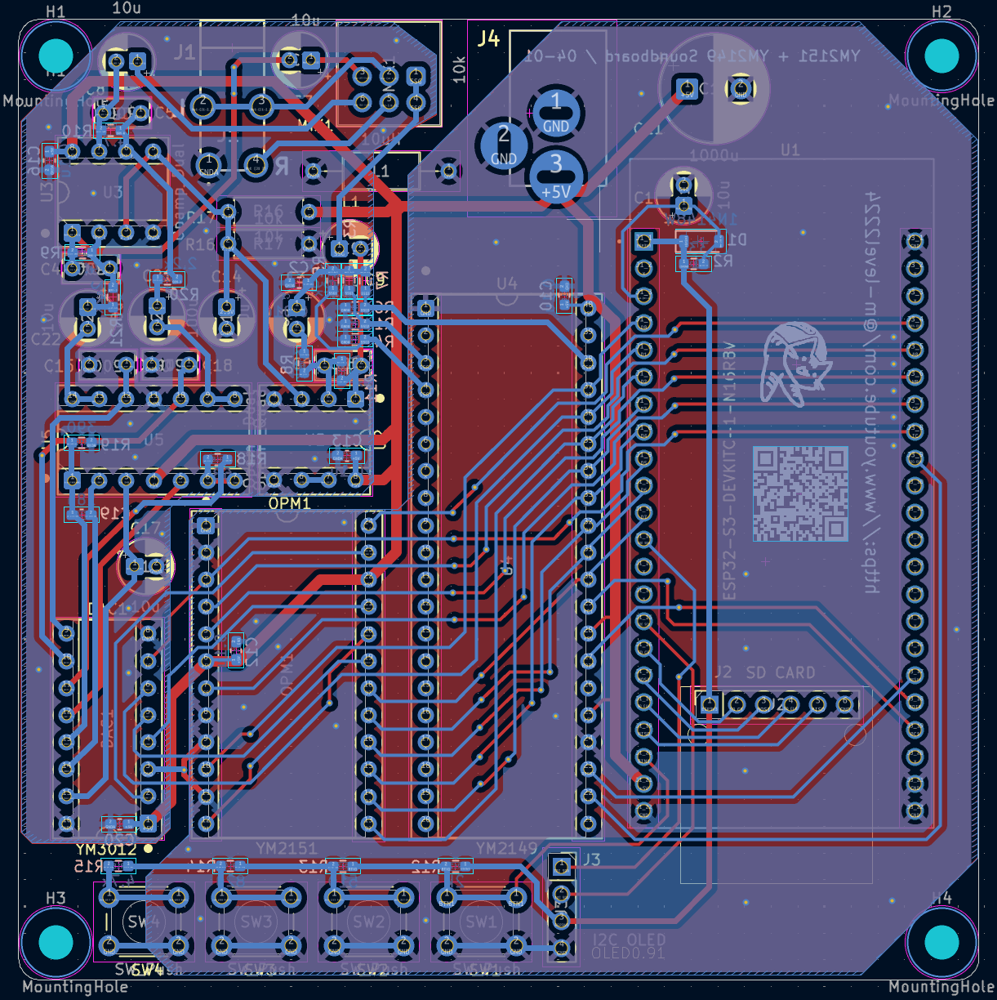

# source-96
OPM SSG soundboard

This system plays VGM files using YM2149 and YM2151 sound chips. The sound board is particularly well-suited for playing VGM data from the Sharp X1turbo. I wrote the source code for the ESP32-S3-DEVKIT-C1 (e.g., ESP32N16R8). While there are likely many bugs, it is currently functional.

Please watch the video for details. https://youtu.be/fPR9RJVCju8

# License
The source code is licensed MIT. The website content is licensed CC BY 4.0,see LICENSE.

